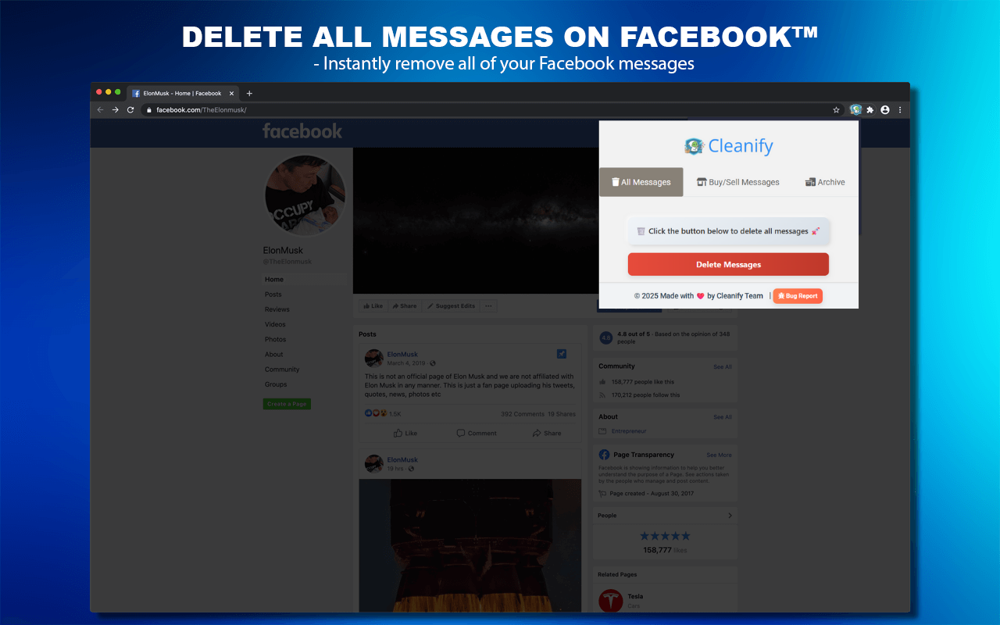
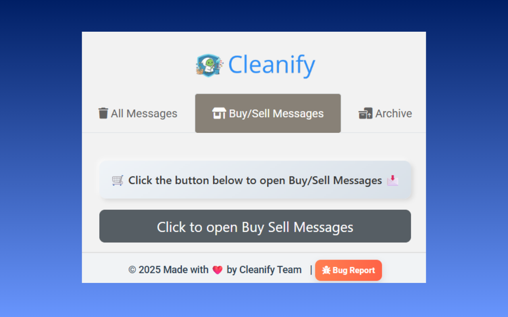
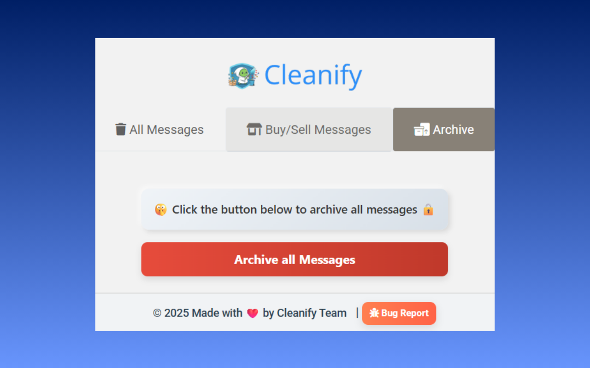

  

  <b>Clean your Facebook Messenger in seconds — delete unwanted chats, stay organized, and protect your privacy.</b>

<h1 align="center">Cleanify – FB Chat Cleaner</h1>

  <b>Remove All Messages, Marketplace Chats & More!</b> 
  Version 1.0.1 • Developed by <a href="https://amitdas.site">Amit Das</a>

---

## 🧩 Overview

**Cleanify – FB Chat Cleaner** is a simple, secure, and fast browser extension that helps you **clean your Facebook Messenger and Marketplace chats** effortlessly.  
Delete hundreds of messages automatically, keep your inbox clutter-free, and enjoy a faster, organized Messenger experience — all while keeping your privacy fully protected.

---

## ⬇️ Download Extension

Get the latest version of **Cleanify** from the **Chrome Web Store** or **GitHub Releases**.

  <!-- Chrome Web Store Button -->
  
  &nbsp;&nbsp;
  <!-- GitHub Download Button -->
  

### 🧭 Manual Installation Steps
1. Download the `.crx` file from the link above *(or install directly from the Chrome Web Store)*.  
2. Open `chrome://extensions/` in your Chrome browser.  
3. Enable **Developer Mode** (top right corner).  
4. Drag and drop the `.crx` file onto the page.  
5. Cleanify will install automatically. ✅

---

## ⚙️ Features

✅ **Instant Chat Cleanup**  
- Delete all **Messenger** conversations at once.  
- Clean **Marketplace Buy/Sell** messages easily.  
- **Archive old chats** for later reference.  

✅ **Smart Privacy Controls**  
- Everything runs locally in your browser.  
- **No remote servers, no tracking, no data sharing.**

✅ **Multi-Tab Interface**  
- Separate tabs for **All Messages**, **Buy/Sell Messages**, and **Archived Chats**.  
- Pause, stop, or resume cleanup anytime.

✅ **User-Friendly Design**  
- Clean, intuitive interface that looks and feels natural inside Facebook Messenger.  
- Live progress indicator for real-time cleanup tracking.

✅ **Multi-Language Support**  
- Works with all Facebook languages worldwide.

---

## 🖼️ Screenshots

### ✨ Clean Messenger Inbox

### ✨ Buy/Sell Message Cleanup

### ✨ Archive Mode

---

## 🔒 Privacy & Security

- Cleanify does **not** collect, store, or share any personal data.  
- All cleanup actions are performed **locally** in your browser.  
- No third-party analytics or tracking scripts.  

Read our full [Privacy Policy](https://github.com/AmitDas4321/Cleanify-FB-Chat-Cleaner/blob/main/PRIVACY.md).

---

## 🧰 Permissions Used

| Permission | Purpose |
|-------------|----------|
| `storage` | Saves your cleanup preferences and progress locally. |
| `tabs` | Identifies Messenger tabs for cleanup actions. |
| `activeTab` | Runs cleanup scripts on the current Messenger or Marketplace tab. |
| `identity` | Allows access to Chrome’s identity API to verify user license securely. |
| `identity.email` | Used only to retrieve the user’s Chrome profile email for license validation. |

**Host Permissions:**  
`https://www.facebook.com/*`  
→ Required to access Messenger and Marketplace chats for cleanup.

---

## 💬 Support

Need help or want to suggest a feature?  
📧 Email: [info@amitdas.site](mailto:info@amitdas.site)  

---

## 📜 License

This extension is © 2025 **Amit Das**.  
All rights reserved. Redistribution or modification without permission is prohibited.

---

  <b>Made with ❤️ by <a href="https://amitdas.site">Amit Das</a></b> 
  ☕ Support development: <a href="https://paypal.me/AmitDas4321">PayPal.me/AmitDas4321</a>

